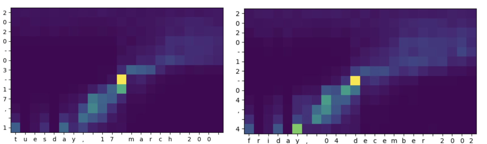

[keras] Simple attention mechanism test
===
## Architecture

## Problem Definition
Testing simple attention mechanism  
Purpose : translate date format  

Input format : 2014-04-13, 6  
Output format : sunday, 13, april 2014  

## Result  
- batch size : 64
- epoch : 50  
  
- Attention layer result    

## Environment
- Python : 3.7.10  
- Tensorflow ; 2.4.1  
- keras : 2.4.3  
- Numpy : 1.19.5  

## Additional Resources
[1] <a href="https://github.com/YeongHyeon/MNIST_AttentionMap#readme">[TensorFlow] Attention mechanism with MNIST dataset</a> by YeongHyeon Park